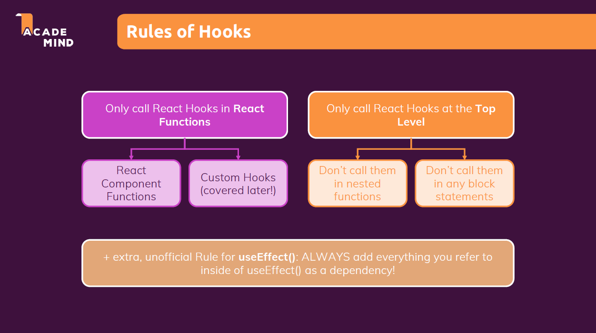

## LEARNING NOTES

## 1.  react basic & props
  - useState to passing data via 'props'
  - use re-usable UI composition via {props.children}
  - user interaction & state
  - working with multiple states (one or more state)
    - updating state that depends on the previous state
  - add two-way binding
  - child-to-parent component communication (bottom-up) by lifting the state up
  - controlled vs uncontrolled components
  - rendering lists of content
  - rendering content under certain conditions

## 2. CSS modules
  - dynamic styles

## 3. practice [name list]
  - create Error Modal component, mange the error state
  - create a wrapper component
  - React Fragments
    - end up less unnecessary html elements
  - React Portals
    - an overlay to the entire page => right below the body as a direct child of body

## 4. useEffect()
- return is run except for the first time render

## 5. useReducer() 
- more complex state => if it got multiple states, multiple ways of changing, or dependencies
- useReducer can be used as a replacement for useState if you need 'more powerful state management'

## 6. useContext

## 7. React.memo() & useCallback()
- prevent unnecessary re-evaluations with React.memo()
- prevent function re-creation with useCallback()

## 8. Sending Http Requests
- connecting to a database
  - use async and await to get data from back-end
  - handle loading & data states
  - using useEffect() for sending requests
- Build Custom React Hooks 
  - 使用useCustomHooksName让react知道这是一个hook 
  - 可传参数，可return 
  - 在component里解构获得return的内容
  - bind()

## 9. Redux

## 10. Router
- building a multi-page SPA with Router

## 11. Lazy Loading
- import React and {Suspense}
- const 组件名 = React.lazy(()=>import('./组件路径'))
- 用Suspense包裹Route标签并指定fallback，否则会无法跳转到lazy loading的页面
  -<Suspense fallback={
Loading...
}> <Route/> </Suspense> 
